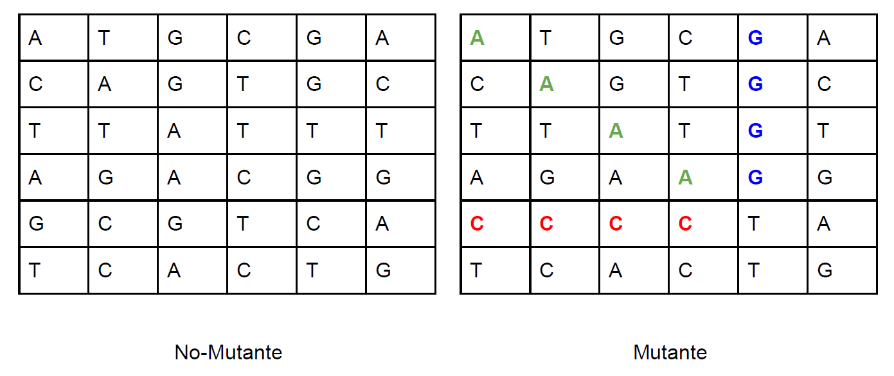
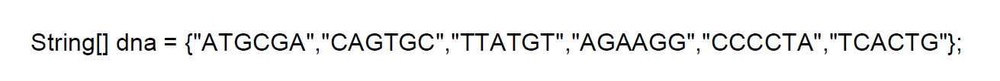
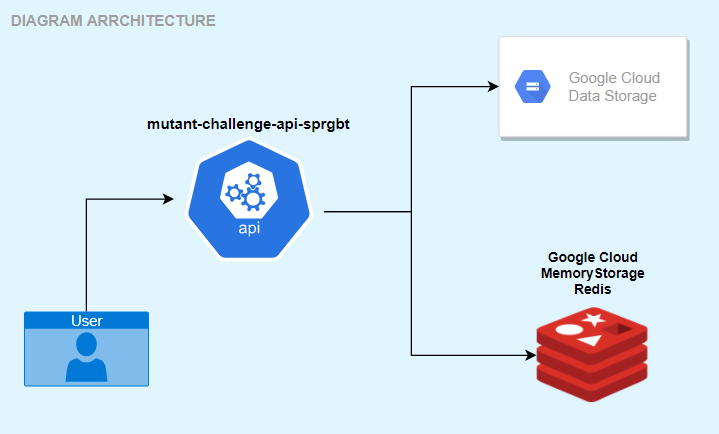
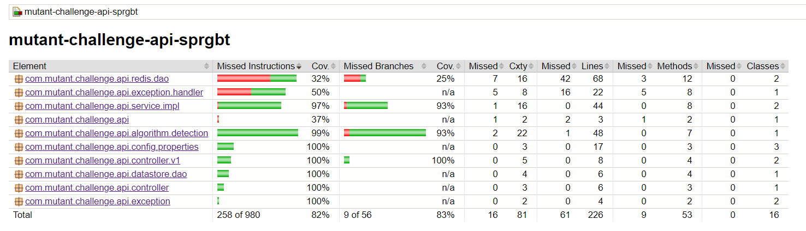

# CHALLENGE MERCADO LIBRE


## MUTANT DETECTOR API

MAGNETO wants to recruit as many mutants as possible to be able to fight the X-MEN.

And to achieve this objective, the development and implementation of this API was carried out in order to be able to detect through a sequence of characters that represent a size table (NxN) where the rows and columns refer to the base nitrogen of DNA, if the DNA corresponds to that of a human or that of a mutant.

To carry out this detection between whether it is a mutant or a human, the following consideration must be taken into account, and that is that it has already been fully identified that a DNA sequence corresponds to that of a mutant if and only if within the corresponding table more than one sequence of 4 identical letters is found in the DNA sequence, in any of the following ways: horizontal, vertical or diagonal. In addition, it must also be taken into account that DNA sequences must only contain the following letters (A, T, C, G).

Below you can see, as a graph, the considerations to detect if a DNA sequence corresponds to that of a mutant or that of a human mentioned above:



Here is an example of a DNA sequence corresponding to that of a mutant that meets the considerations set out above:




To see the complete documentation, [access through the following LINK.](docs/Examen_BE_Mercadolibre_-_Mutantes.pdf)


## MUTANT DETECTION ALGORITHM

The documentation related to the algorithm developed and implemented in the API to detect if a DNA sequence corresponds to that of a mutant or that of a human, [you can find it in the following LINK](docs/DetectionAlgorithm.md)


## ARCHITECTURE DIAGRAM

The following is how the construction of this software component was planned through the following architecture diagram, in order to provide retrospective documentation, knowledge sharing and learning.




The previous architecture diagram identifies the following components:

### mutant-challenge-api-sprgbt

Represents the REST API in charge of receiving requests with DNA sequences, in order to detect which of these corresponds to that of a mutant or a human. And it is also in charge of providing the user with the information corresponding to the statistics in relation to the ratio between mutants and humans.


### Google Cloud DataStorage

Datastore is a very scalable NoSQL database that you can use with your applications. It automatically takes care of fragmentation and replication, giving you a durable, highly available database that scales automatically to handle the load on your applications. In addition, it offers countless functions, such as ACID transactions, SQL-like queries, indexes, and much more.

Used in this architecture to persist in it the information related to the DNA sequences tested.


### Google Cloud MemoryStorage - Redis

Memorystore for Redis provides a fully managed service for Redis in-memory data storage that allows you to create application caches to provide access to data in less than milliseconds.

Used in this architecture to persist and obtain from it the information related to the number of DNA sequences detected as mutants and as humans. To calculate the statistics related to the ratio between mutants and humans.


## AUTOMATIC TESTS

One of the development practices that characterizes a professional programmer is writing automated tests. Testing is so important that it practically defines the project development flow.

Below you can see information related to some load tests performed on the component, [accessing through the following LINK](docs/Tests.md)


## DEMO

EndPoints associated with the functionality

- [POST:/mutant](http://{url_ip}/mutant)

```
curl -H "Content-Type: application/json" -X POST -w "\n%{http_code}\n" -d '{"dna": ["ATGCGA","CAGTGC","TTATGT","AGAAGG","CCCCTA","TCACTG"]}' http://{url_ip}/v1/mutant
200 OK
```

- [GET:/stats](http://{url_ip}/stats)

```
curl --location --request GET http://{url_ip}/v1/stats

{"countMutantDna":1,"countHumanDna":1,"ratio":1.0}

200 OK
```


HealthCheck is an extra EndPoint associated with the REST service used to show the active status of the component.

- [GET://healthCheck](http://{url_ip}/healthCheck)

```
curl --location --request GET 'http://{url_ip}/healtcheck'

HealthCheck
200 OK
```


## HOW TO START ? 🚀

### REQUIREMENTS 📋

The project was developed with the following technologies:

- Java 1.8.0_231
- Maven 3.6.0
- Spring-Boot 2.3.5
- Lombok 1.18.16
- JUnit 5
- Mockito Core 3.1.0
- Jacoco 0.8.6
- Sonar 3.5.0.1254
- Google Cloud Platform
- Google Cloud DataStorage
- Google Cloud MemoryStorage - Redis
- Docker
- Kubernetes


### INSTALLATION 🔧

Execute the following instructions:

#### CLONE AND INSTALLATION
```
# Clone SpringBoot Project
git clone --branch release https://github.com/richardmartinezv/mutant-challenge-api-sprgbt.git
cd mutant-challenge-api-sprgbt

mvn clean install -P pro

```

## Test 

#### UNIT TEST COVERAGE

```
# Execute Unit Test
mvn test 
mvn jacoco:report

# Open file in browser to see coverage of Tests
target/site/jacoco/index.html
```




### TESTING ENDPOINTS

Create the environment in postman for the execution of the tests:

| Env   | variable | value                 |
|-------|----------|-----------------------|
| local | host     | http://localhost:8080 |
| pro   | host     | http://{URL_IP}       |


## DEPLOYMENT 📦

```bash 
# clone project 
git clone --branch release https://github.com/richardmartinezv/mutant-challenge-api-sprgbt.git
cd mutant-challenge-api-sprgbt

# execute prepare-enviroment script
## Creates an App Engine application.
## Exports environment variable GCLOUD_PROJECT.
## Runs mvn clean install -P pro
## Copy jar to Docker workspace
## Create Container Engine cluster
## Building Containers
## Deploy to Container Engine
## Prints out the Project ID.
sh prepare_environment.sh

# check
click Navigation menu > Kubernetes Engine > Workloads 
```


## BUILD WITH 🛠️

Technologies and tools used in the development of the project:

* [Sprint Boot](https://spring.io/projects/spring-boot) - The Web Framework
* [Maven](https://maven.apache.org/) - Dependencies Management
* [Google Cloud Platform](https://cloud.google.com/) - Cloud Provider
* [Google Kubernetes Engine](https://cloud.google.com/kubernetes-engine/) - Deployment Tool
* [DockerHub](https://hub.docker.com/) - Repository service provided by Docker
* [Spring Tools](https://spring.io/tools) - IDE


## AUTHORS ✒️


* **Richard Martinez Valderrama** - *Senior Software Developer* - [richardmartinezvalderrama](https://gitlab.com/richardmartinezvalderrama)

see **contributors**

## LICENSE 📄

This project is under license [LICENSE](LICENSE) 


## CONTRIBUTORS

[](https://gitlab.com/richardmartinezvalderrama)

---
